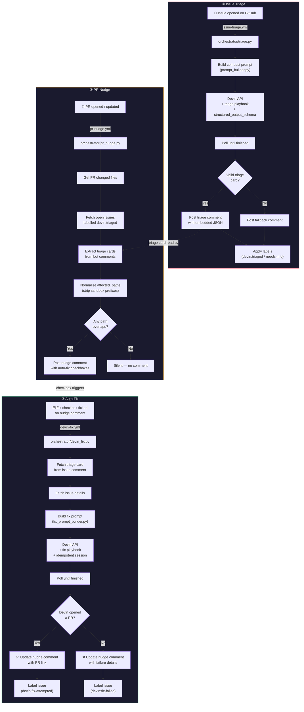

# cognitiveload

AI-powered issue triage, PR nudging, and auto-fix pipeline built on [Devin](https://devin.ai) and GitHub Actions.

## Architecture



### How the pieces connect

| Workflow | Trigger | Orchestrator | Devin Playbook | Key output |
|----------|---------|-------------|----------------|------------|
| `issue-triage.yml` | Issue opened | `triage.py` | `playbooks/triage.md` | Triage comment + labels |
| `pr-nudge.yml` | PR opened/synced | `pr_nudge.py` | — | Nudge comment with fix checkboxes |
| `devin-fix.yml` | Checkbox ticked | `devin_fix.py` | `playbooks/fix.md` | Fix PR opened by Devin |
| `upload-playbooks.yml` | Manual dispatch | `scripts/upload_playbooks.py` | — | Prints playbook IDs |

### Shared modules

| Module | Role |
|--------|------|
| `devin_client.py` | Devin v1 API wrapper (sessions, polling, retry) |
| `github_client.py` | GitHub REST API wrapper (comments, labels, PRs) |
| `prompt_builder.py` | Triage prompt — compact (playbook) or full (inline) |
| `fix_prompt_builder.py` | Fix prompt — same compact/full pattern |
| `validation.py` | Client-side JSON Schema validation (belt-and-suspenders) |
| `playbook_ids.py` | Hardcoded Devin playbook IDs |
| `schemas/triage_card.schema.json` | Triage card schema — sent to Devin API + used locally |

### Cost guardrails

| Setting | Default | Where |
|---------|---------|-------|
| `TRIAGE_MAX_ACU` | 5 | Repo variable → `issue-triage.yml` |
| `FIX_MAX_ACU` | 10 | Repo variable → `devin-fix.yml` |

## Setup

```bash
# 1. Clone and install
git clone https://github.com/saml7n/cognitiveload.git
cd cognitiveload
uv sync

# 2. Configure secrets (GitHub repo settings → Secrets)
#    DEVIN_API_KEY  — from https://app.devin.ai/settings
#    GITHUB_TOKEN   — auto-provided by Actions (needs Issues + PRs R/W)

# 3. Run tests
PYTHONPATH=. uv run pytest orchestrator/tests/
PYTHONPATH=. uv run pytest demo_app/tests/
```

## Project structure

```
.github/workflows/       # GitHub Actions triggers
orchestrator/            # Core Python orchestration
  devin_client.py        # Devin API client
  github_client.py       # GitHub API client
  triage.py              # Issue triage entrypoint
  pr_nudge.py            # PR nudge entrypoint
  devin_fix.py           # Auto-fix entrypoint
  prompt_builder.py      # Triage prompt construction
  fix_prompt_builder.py  # Fix prompt construction
  validation.py          # Schema validation
  playbook_ids.py        # Devin playbook IDs
  schemas/               # JSON Schema files
  tests/                 # Unit tests (129 tests)
playbooks/               # Devin playbook markdown files
scripts/                 # Upload + smoke test utilities
demo_app/                # FastAPI demo app for testing
```
